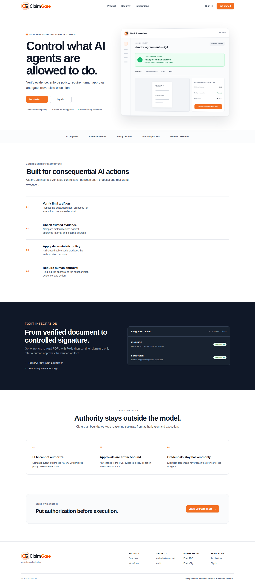
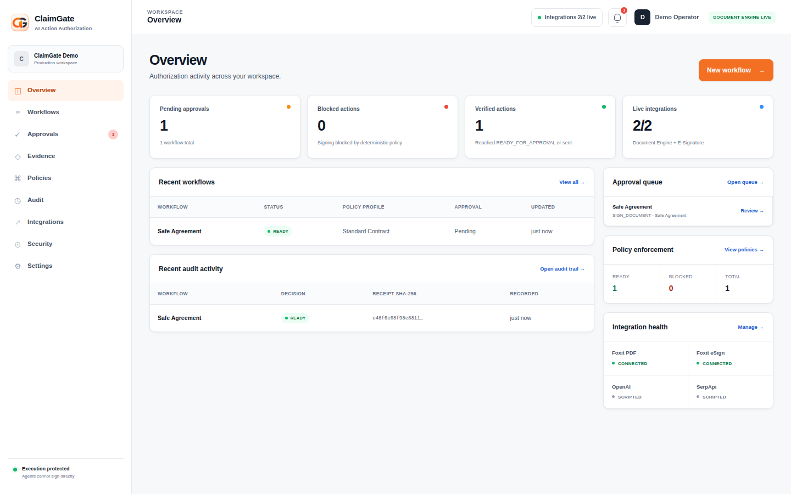
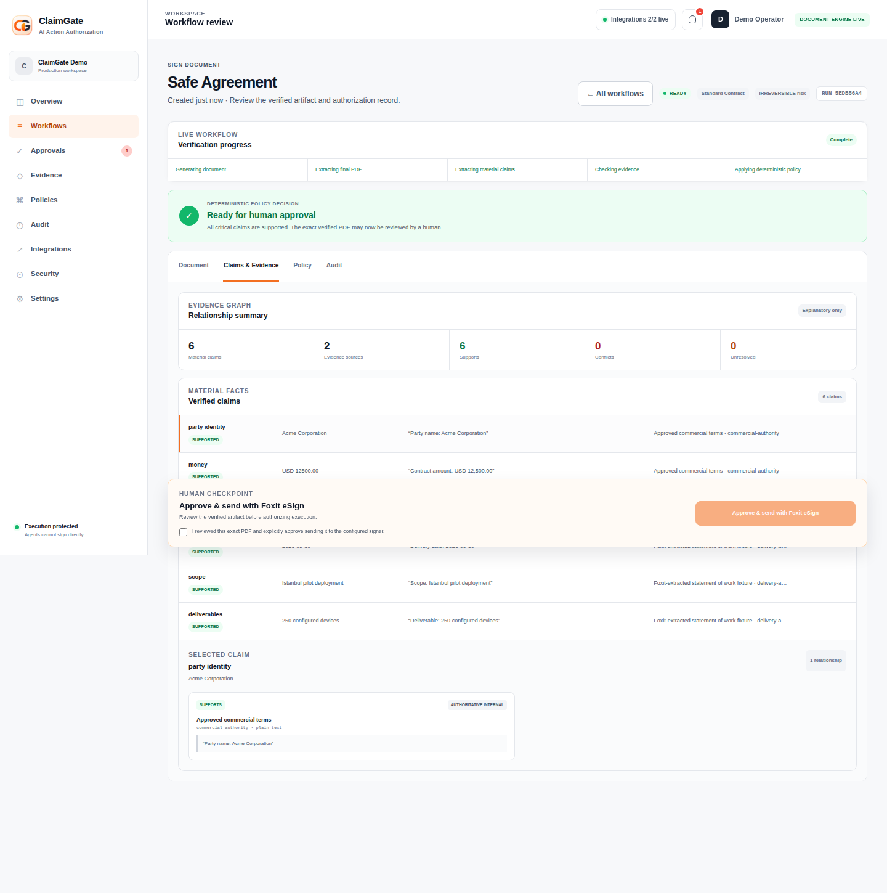

<p align="center">
  
</p>

<h1 align="center">ClaimGate</h1>
<p align="center"><strong>AI Action Authorization Platform</strong></p>
<p align="center">Control what AI agents are allowed to do before irreversible execution.</p>
<p align="center">
  ClaimGate verifies final artifacts against trusted evidence, applies deterministic policy,
  binds human approval to the exact verified action, and exposes irreversible execution only
  through controlled backend capabilities.
</p>
<p align="center">
  Built for the <strong>DevNetwork [API + Cloud + AI] Hackathon 2026</strong><br>
  Foxit challenge: <strong>Your Agent Shouldn’t Sign That</strong>
</p>
<p align="center">
  
  
  
</p>

## Why ClaimGate exists

AI agents can propose consequential actions, but model confidence is not authorization. A signed
document, payment, deployment, or database mutation needs a control boundary that remains valid
when a model is wrong, manipulated, or compromised.

ClaimGate puts that boundary between an AI proposal and execution:

> **AI can propose. ClaimGate verifies evidence and policy. Humans authorize. Backends execute.**

Document signing is the first fully implemented irreversible action. ClaimGate is not merely an
AI contract checker: it models authorization as a typed `ProposedAction`, binds approval to the
exact reviewed state, and keeps execution credentials outside the agent boundary.

## What it does

- Generates and re-reads the final PDF through Foxit PDF Services.
- Extracts material claims through a schema-constrained semantic provider with no tool access.
- Compares claims with trusted evidence and enforces verbatim grounding.
- Applies a deterministic, fail-closed baseline policy.
- Optionally applies Policy-as-Code profiles that may add blockers but cannot remove baseline
  blockers.
- Requires explicit human approval bound to the artifact, evidence, policy, and proposed action.
- Sends the approved document through backend-only Foxit eSign credentials.
- Issues tamper-evident Decision Receipts and supports read-only historical replay.
- Exercises the real authorization boundaries through a fixed Security Validation Suite.

## How it works

```text
AI or user proposes an action
            │
            ▼
Foxit produces the final PDF artifact
            │
            ▼
Semantic extraction and evidence comparison  (untrusted assistance)
            │
            ▼
Deterministic policy + additive policy profile (authorization decision)
            │
     BLOCKED ┴ READY_FOR_APPROVAL
                      │
                      ▼
          Human reviews exact bindings
                      │
                      ▼
          Backend executes at most once
                      │
                      ▼
       Decision Receipt + audit/replay
```

The semantic layer can help extract and compare data, but it cannot output an authorization,
select an execution adapter, access Foxit eSign credentials, or bypass policy.

## Product screenshots

### Public product page



### Operational dashboard



### Verified workflow review



## Real document verification flow

1. Upload a PDF and supporting evidence.
2. Select a policy profile.
3. ClaimGate re-reads the actual PDF through Foxit and extracts material claims.
4. Each material claim is compared with cited evidence; quotations must exist verbatim in the
   cited source.
5. The deterministic baseline policy returns `READY_FOR_APPROVAL` or `BLOCKED`.
6. An additive profile may tighten that result.
7. A human reviews the artifact and explicitly approves the exact cryptographic bindings.
8. The backend re-verifies those bindings immediately before the eSign call.

## Foxit integration

Foxit is part of the live document-signing path, not a visual mock:

- **Foxit PDF Services** generates and extracts the final PDF artifact through the official Foxit
  MCP server boundary.
- **ClaimGate** validates the extracted claims, evidence, and deterministic policy result.
- **The AI agent cannot sign** and never receives Foxit eSign credentials.
- **A human approves the exact verified artifact** through an explicit confirmation action.
- **Foxit eSign remains backend-only and human-triggered**, protected by binding re-verification
  and the `FOXIT_ESIGN_CONFIRM_SEND=YES` operator latch.

Only document signing is wired to a live irreversible backend. The other action types in the
capability registry are deliberately marked as simulated.

## Architecture

The FastAPI application coordinates five trust zones:

| Zone | Responsibility | Authority |
|---|---|---|
| Browser and input | Upload, review, explicit approval | Cannot authorize or access credentials |
| Semantic provider | Structured extraction and comparison | Untrusted data only; no tools |
| ClaimGate core | Hashing, Evidence Graph, policy, workflow state | Deterministic authorization |
| Human approval | Confirms the exact reviewed bindings | Required before live execution |
| Execution adapter | Calls Foxit eSign from the backend | Scoped, credentialed, at most once |

See [docs/architecture.md](docs/architecture.md) for the full trust-boundary and enforcement
reference.

## Security model

ClaimGate is designed around structural constraints rather than prompt-only assurances:

- Strict Pydantic semantic schemas use `extra="forbid"` and contain no approval or execution
  field.
- The semantic provider protocol exposes no tools.
- Deterministic policy is fail-closed on missing, conflicting, duplicate, or unknown inputs.
- Policy profiles are strictly additive.
- Approval records bind canonical hashes for the artifact, evidence, policy, and action.
- Bindings are re-derived immediately before execution to reduce TOCTOU risk.
- Execution capabilities are defined in a static, code-owned registry.
- Foxit eSign credentials and the live-send latch stay backend-only.

### Evidence Graph

The Evidence Graph is an explanatory projection of the verification result. It connects claims,
evidence sources, policy findings, and authorization outcomes while preserving explicit authority
classes. It does not replace the deterministic policy decision.

### Policy-as-Code

Built-in policy profiles are strict YAML/JSON data, not executable code. They can require stronger
evidence or introduce additional blockers. An invariant prevents any profile from converting a
blocked baseline decision into an approval-ready decision.

### Human approval and eSign

Approval is not a generic checkbox. It is a record bound to the exact PDF hash, evidence hash,
policy version/profile, and canonical action hash. The live sender checks both explicit human
confirmation and the environment-level send latch before Foxit eSign is invoked.

### Decision Receipts

Each completed decision can produce a canonical, SHA-256-bound receipt containing the action,
artifact, evidence, policy, approval, execution, and previous-receipt bindings. Receipts form a
tamper-evident chain.

### Historical Replay

Replay independently compares a historical receipt with current server state. It is read-only: it
cannot invoke semantic analysis, create an approval, mutate workflow state, or execute an action.

### Security Validation Suite

The suite covers adversarial cases such as prompt injection, invented quotations, artifact drift,
approval replay, duplicate send attempts, receipt tampering, and action-binding drift. Scenarios
exercise the actual validators and report pass/fail outcomes without creating an alternate
execution path.

## Public evidence

Public evidence discovery is provider-boundary code, not authorization. Scripted results are the
safe default; SerpApi can be enabled for live backend-only discovery. Search output cannot mint
`AUTHORITATIVE_INTERNAL` evidence, and the browser never receives provider credentials.

## General action authorization

The `ProposedAction` model and static capability registry also describe email, deployment,
purchase, payment, and database-write actions. These adapters are simulated in the current
implementation. They demonstrate how the authorization model generalizes without presenting
unimplemented integrations as live.

## Technology stack

- Python 3.11+
- FastAPI and Uvicorn
- Pydantic strict models
- Foxit PDF Services through the official MCP server
- Foxit eSign backend API
- OpenAI Responses API or deterministic scripted semantic provider
- SerpApi or deterministic scripted public-evidence provider
- Server-rendered HTML with focused CSS and JavaScript
- Pytest and Ruff

## Quick start

Prerequisites: Python 3.11+ and [`uv`](https://docs.astral.sh/uv/).

```bash
uv sync --extra dev
cp .env.example .env
uv run claimgate-demo-web
```

Open <http://127.0.0.1:8000>, create a local workspace, and continue to `/app`. The default
semantic and public-evidence providers are deterministic scripted providers. A real Foxit PDF
workflow requires the Foxit configuration below.

## Configuration

Copy `.env.example` to `.env`. `.env` and credential-bearing variants are ignored by Git.

| Setting group | Purpose | Safe default |
|---|---|---|
| `FOXIT_CLOUD_API_*` | Foxit PDF Services host and credentials | Placeholder; configure for real PDF processing |
| `FOXIT_PDF_MCP_DIRECTORY` | Local official Foxit MCP Python server path | Placeholder |
| `FOXIT_ESIGN_*` | Backend eSign endpoint, credentials, and recipient | Placeholder |
| `FOXIT_ESIGN_CONFIRM_SEND` | Operator latch for live send | `NO` |
| `CLAIMGATE_SEMANTIC_PROVIDER` | `scripted` or `openai` | `scripted` |
| `OPENAI_API_KEY` / `CLAIMGATE_OPENAI_MODEL` | Live semantic provider | Placeholder |
| `CLAIMGATE_PUBLIC_EVIDENCE_PROVIDER` | `scripted` or `serpapi` | `scripted` |
| `SERPAPI_API_KEY` | Live public-evidence discovery | Placeholder |
| `CLAIMGATE_WEB_*` | Host, port, and local artifact directory | Loopback / local artifacts |

Never enable `FOXIT_ESIGN_CONFIRM_SEND=YES` unless you intend to send to a consenting recipient
whose inbox you control.

## Running the application

```bash
uv run claimgate-demo-web
```

Useful routes:

- `/` — public product page
- `/signup` and `/login` — local account flow
- `/app` — operational overview
- `/app/workflows` — workflow list and real document verification entry point
- `/app/approvals` — formal approval queue
- `/app/evidence`, `/app/policies`, `/app/audit` — verification and audit surfaces
- `/app/integrations`, `/app/security`, `/app/settings` — configuration and assurance

## Running tests

```bash
uv run pytest
uv run ruff check .
node --check src/claimgate/web/static/app.js
node --check src/claimgate/web/static/auth.js
node --check src/claimgate/web/static/landing.js
```

Tests marked `live` require explicit Foxit credentials and
`CLAIMGATE_RUN_LIVE_FOXIT=1`; they are skipped during normal local runs.

## Project structure

```text
src/claimgate/
├── actions/           # ProposedAction model, capability registry, adapters
├── application/       # Workflow orchestration and approval boundary
├── audit/             # Decision Receipts
├── domain/            # Typed models, hashing, policy, state machine
├── evidence_graph/    # Explanatory verification graph
├── integrations/      # Foxit PDF/MCP and Foxit eSign clients
├── policy_profiles/   # Additive Policy-as-Code
├── public_evidence/   # Scripted and SerpApi provider boundary
├── redteam/           # Security validation scenarios
├── replay/            # Read-only historical verification
├── semantic/          # Scripted/OpenAI structured semantic boundary
└── web/               # FastAPI routes, auth, uploads, templates, static UI
tests/                 # Unit and integration tests
docs/                  # Architecture, submission copy, product screenshots
```

## Current limitations

- Users, sessions, workflow runs, approvals, and audit state are process-local.
- Documents and evidence use local filesystem storage rather than object storage.
- Authentication is suitable for local evaluation, not production identity or tenancy.
- Live PDF/eSign flows require operator-managed Foxit credentials and MCP setup.
- Semantic extraction can be fallible; authorization therefore remains deterministic and
  fail-closed.
- Foxit eSign is the only live irreversible action adapter; the other registered actions are
  simulation-only.

## Roadmap

The following items are planned and are **not implemented in the current repository**:

- Persistent PostgreSQL-backed workflows and audit state
- Object storage for documents and evidence
- Production identity/authentication
- Multi-tenant organizations and workspaces
- RBAC and approval chains
- Background workers
- React/Next.js frontend if product scale justifies it
- Production Foxit eSign lifecycle support
- Additional trusted evidence connectors
- Additional irreversible action adapters
- Enterprise SSO and audit retention

## Hackathon submission

ClaimGate is submitted to the **DevNetwork [API + Cloud + AI] Hackathon 2026** for the Foxit
challenge **“Your Agent Shouldn’t Sign That.”** The submission demonstrates this concrete safety
boundary:

1. Foxit generates and re-reads the final PDF artifact.
2. ClaimGate verifies claims against evidence before authorization.
3. The AI agent cannot sign and does not hold Foxit eSign credentials.
4. A human must approve the exact verified artifact and action.
5. Foxit eSign is invoked only from the controlled backend execution boundary.

Submission copy and demo framing are maintained in [docs/devpost.md](docs/devpost.md).
